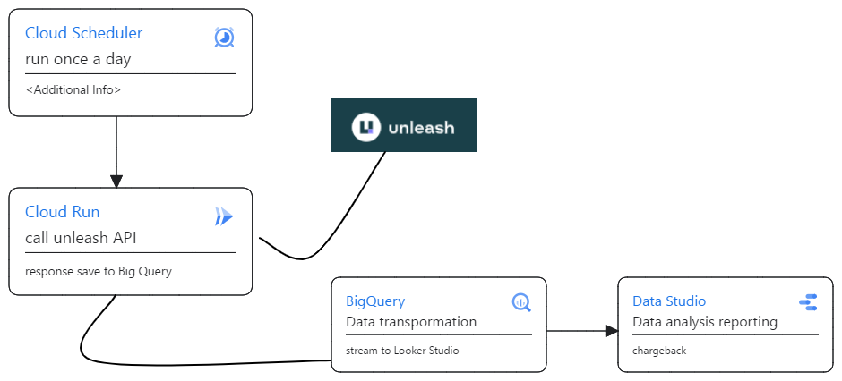

# Executive Visit - Team reviews - Hybrid Cloud - Enable TELUS

## 2023 Highlights and Activities

- Unleash [documenation](https://docs.getunleash.io)
- Unicorn Ai
- Risk Engine CRQ Automation
- Github Finops Metrics
- DevOps Research and Assessment

## Key team initiatives

`Create a solution design to measure the benifits and ROI`

`Nest.js Application`

- It is responsible for making API calls to the external software to fetch data.
- It involves scheduling tasks to run at regular intervals (e.g., every hour) to collect fresh data.

`API Integration`

- Understanding and interacting with the API of the external software is a key part of this process.

`Data Transformation and Processing`

- After fetching data, there may be some transformations or processing applied to the raw data before storing it in BigQuery.

`BigQuery`

- Serving as the data warehouse, BigQuery is where the collected and processed data is stored.
- Structuring the data tables appropriately based on your analysis and reporting needs.

`Scheduled Jobs`

- The scheduling mechanism (every hour) is crucial for regularly updating the data in BigQuery.

`Monitoring and Maintenance`

- Setting up monitoring tools or processes to ensure the pipeline is running smoothly.
- Handling any maintenance tasks, such as updates to the Nest.js application or changes in the external API.

`Looker Studio`

- Data Analysis reporting and chargeback

## Future technologies

- MultiCloud
- Github CodeQl
- Prisma
